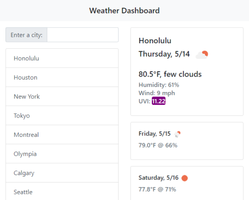

# Weather Dashboard

A weather app that provides current weather and forecast data on searched cities.
Powered by [OpenWeatherMap API](https://openweathermap.org/)

## Usage

### [Try it!](https://mgrinx.github.io/weather-dashboard)
Type the name of a city and press enter to search.

## Features

- Temperature, humidity, wind speed, UVI
- Weather icons and description
- 5-day future forecast
- Dynamically updated and locally stored search history